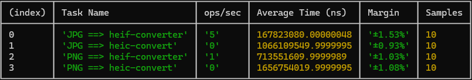
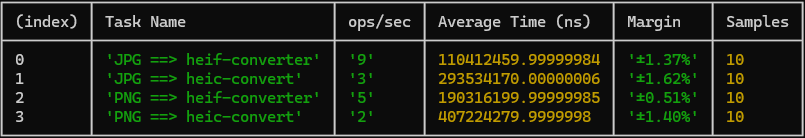
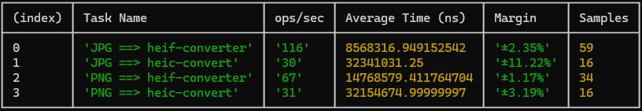

<p align="center">

</p>

# 🥦 HEIF-Converter
> This module uses the C APIs libheif to bind it in Node.js using N-API.

## ⭐ Introduction

The **libheif** library is a software library used to read and write HEIF (High Efficiency Image Format) files.

HEIF is a file format for images and image sequences (like photos and videos) that offers superior compression compared to traditional formats like JPEG and PNG while maintaining high image quality.

For more information about the librarie used in this project, you can visit the following links:
* [libheif](https://github.com/strukturag/libheif/tree/master)
* [libjpeg](https://github.com/winlibs/libjpeg)
* [libpng](https://github.com/pnggroup/libpng)

## ❤️ Motivations

We created this module because, to date, we have not yet found a package that uses Node.js bindings for the libheif C library. Libraries like [heic-convert](https://github.com/catdad-experiments/heic-convert), and others are very interesting but do not allow full utilization of the performance and speed of the C library.

Moreover, this project allows you to use asynchronous methods that will run in an **AsyncWorker**, which will prevent blocking the event loop of your application.

## 💥 Prerequisites

Before installing **heif-converter**, make sure you have the following tools installed on your machine:

* [**Node.js**](https://nodejs.org/en/download/package-manager/)

## 🎈 Conversion
The **heif-converter** package facilitates the conversion of HEIF (High Efficiency Image File Format) images to other formats. However, it's important to note that this package specifically handles static images and does not support animated images. Additionally, metadata and auxiliary images within the HEIF file are not currently supported by the converter. You're welcome to contribute by suggesting improvements or enhancements to its functionality 😃.
> heif-converter runs on macOS x64, Windows x64/x86 and Linux x64. 

## 🦴 Installation

```bash
npm install @myunisoft/heif-converter
```

## 🚀 API
<details>
<summary>version</summary>
<br>

The **version** method is used to obtain the version of libheif.

```ts
function version(): string;
```
```js
import lib from "../index.js";

console.log(lib.version());
// 1.17.6
```
</details>
<details>
<summary>toJpeg</summary>
<br>

The **toJpeg** method converts the primary image of a HEIC file to **jpg**.
> Converts only the primary image of the HEIC file.

```ts
interface JpegOptions {
  // 0 to 100.
  quality?: number;
}

function toJpeg(
  input: string | Buffer | Readable, 
  options?: JpegOptions
): Promise<Buffer>;
```
```js
import lib from "../index.js";

const jpegBuffer = await lib.toJpeg("image.heic", { quality: 20 });
```
> The value of the quality option is from 0 to 100. Default 75.

</details>
<details>
<summary>toPng</summary>
<br>

The **toPng** method converts the primary image of a HEIC file to **png**.
> Converts only the primary image of the HEIC file.

```ts
function toPng(input: string | Buffer | Readable): Promise<Buffer>;
```
```js
import lib from "../index.js";

const pngBuffer = await lib.toPng("image.heic", { compression: 5 });
```
> The value of the compression option is from 1 to 9. Default 1.

</details>
<details>
<summary>extract</summary>
<br>

The **extract** method allows you to obtain a list of images contained in a HEIC file. Each extracted image has two methods, **toJpeg** and **toPng**, which allow you to convert the image to JPEG or PNG format, respectively, as documented above.
```ts
interface JpegOptions {
  quality?: number;
}

interface PngOptions {
  compression?: number;
}

interface ExtractedImage {
  toJpeg: (opts?: JpegOptions) => Promise<Buffer>;
  toPng: (opts?: PngOptions) => Promise<Buffer>;
}

function extract(input: string | Buffer | Readable): Promise<ExtractedImage[]>;
```
```js
import lib from "../index.js";

const images = await lib.extract("image.heic");
for (image of images) {
  const jpegBuffer = await image.toJpeg({ quality: 50 });
}
```

</details>

## 📢 Benchmark

The benchmark is accessible in the ./benchmark folder. You can run the following commands.
```bash
$ node ./benchmark/bench.js 1
# OR
$ node ./benchmark/bench.js 2
# OR
$ node ./benchmark/bench.js 3
```
This benchmark was conducted on a mid-range machine.

#### HEIC file containing an image of 3992*2992.


#### HEIC file containing an image of 2400*1600.


#### HEIC file containing an image of 640*426.
