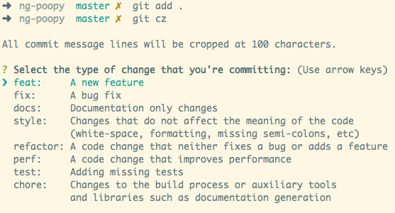

## Introduction

This guide is intended for developers who maintain the project as well as for those who wish to contribute.

## Folders/Files

- 📁 benchmark  
This folder contains all the elements needed to benchmark this package. The `package.json` file allows for coding in ESM.

- 📁 npm  
This folder contains the workspaces that will be used as optional dependencies of heif-converter. Only the `lib` folder is not available on the GitHub repository because it needs to be copied directly from the GitHub workflow artifacts in case of publishing to npm.
The `Dockerfile` files are used both to download the artifacts and to test if the package works well on different platforms during workflows.

- 📁 platform  
This folder contains all the elements of the C library `libheif` compiled using the Microsoft tool [vcpkg](https://github.com/microsoft/vcpkg) on different platforms.
The compilation of libheif on Windows and Linux is done via a GitHub workflow. For macOS, some errors have not yet been resolved to do it via a GitHub workflow, so the compilation is done locally directly on a macOS machine.
The compilation of the C libraries is managed in the workflow `build-lib-c-binaries.yml`.

- 📁 src  
This folder contains the elements written in C that use the C libraries (libheif, libpng, lib-turbojpeg) as well as the `binding.gyp` file, which allows the project to be compiled for Node.js.
The compilation of the project is managed in the workflow `build-node-artifacts.yml`.

- 📁 test  
The workflow used for the tests is `platform-tests.yml`. The `package.json` file allows for coding in ESM.

- 📄 libc.js  
This file is used during the compilation to Node.js in the `binding.gyp` file. It determines whether the compiler on Linux is glibc or musl (Alpine).

## Workflows

- C Libraries Binaries  
This workflow is used to create the necessary binaries of the C libraries libheif, libpng, and lib-turbojpeg depending on the platform. The workflow provides an artifact that can be used to update the project. Simply copy/paste the files from the archive into your local repo if needed.
The version of libheif depends on the ports of the `vcpkg` library. It is possible that, depending on the platform, the version is not the same.

- Node.js Binaries  
Similar to the previous workflow, the .node files for each platform will be available in an archive. The `lib` folder should be copied/pasted into the corresponding workspace, for example, `./npm/linux-x64`.

- Tests  
This workflow copies the project either directly into the GitHub runner or into a Docker image to build and then test the optional dependencies.

## Git

Commits must respect the [Conventional Commits](https://www.conventionalcommits.org/en/v1.0.0-beta.4/) Specification (inspired by Angular one). The objective is to have commits as legible and clear as possible.

Example of commit:

> git commit -m “chore(package): update dependencies”

You can use the [commitizen](https://github.com/commitizen/cz-cli) package to write your commits correctly.

</img>

## Npm

### Versioning

In case of modification of the C file(s) of the project, the artifacts for the optional dependencies should be updated locally, then the workspaces should be versioned and published. The artifacts will of course be available in case a PR triggers the `build-node-artifacts.yml` workflow.
The steps to follow are as follows:

- Open a PR for the changes made (to the files in the `./src/` folder).  
- When the PR passes, merge it and retrieve the artifacts from GitHub Action.  
- Copy the `lib` folders for the correct platform into the local `./npm/` folder.  
- Version the workspaces, commit (e.g., `chore(workspaces): versioning`), and then publish them.
- Update the project's optional dependencies (don't forget `--force`).
- Commit (e.g., `chore: update optional dependencies`).
- Create a pull request so that all platforms are tested with the new optional dependencies.
- Merge the PR, then perform the following actions locally:
```bash
$ git pull
$ npm version (patch|minor|major)
$ git commit -a -m'chore: vx.x.x'
```

## Build from source

If the platform is not supported by heif-converter, you can compile the project yourself on your machine with [vcpkg](https://github.com/microsoft/vcpkg).
You will then need to add a system variable `VCPKG_LIB_ROOT` that points to the folder of your architecture. For example, on a Windows x64 system where vcpkg has been cloned to the `C:/` folder, the system variable should have the value `C:/vcpkg/installed/x64-windows`.